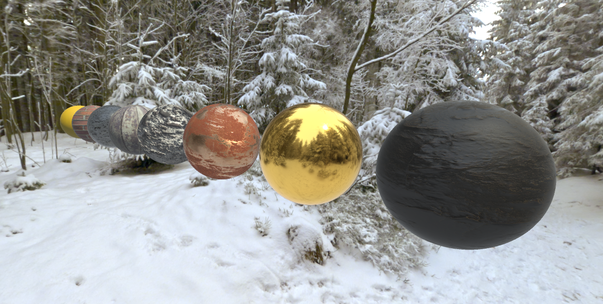
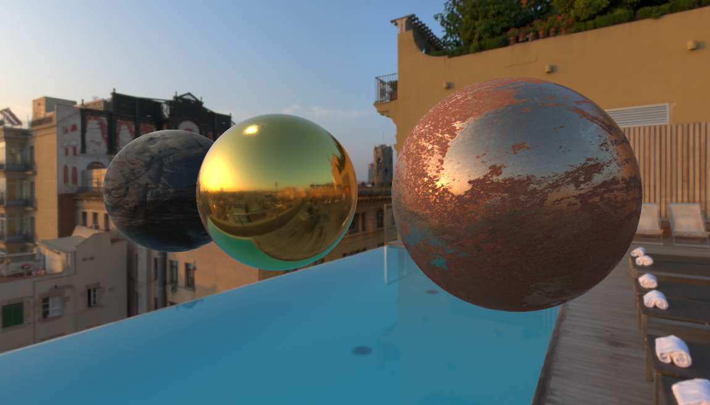

# PBR-Shaders

## Intro

**PBR-Shaders** is a set of shader programs written in Cg to demonstrate how to implement a PBR roughness/metallic workflow for your graphical application.

The physical model for the BRDF consists of:
- _Lambert_ - diffuse component
- _Cook-Torrance_ - specular component

The lighting models are:
- _Directional light_
- _Point light_
- _Spot light_
- _Image-based lighting_ using environment maps

## Samples

  

## Structure

The **Assets** folder contains the shader library, textures, materials and demo scenes.

|Folder| Description  |
|--|--|
| Shaders | **PBRLib.cginc** & **PBRShader.shader** are both the PBR function library and main PBR shader program |
| Materials | Sample materials such as gold, rough stone, slippery rock, walls, etc. |
| Textures | Data for the roughness/metallic workflow, albedo, occlusion and environment maps |
| Scenes | Just demo scenes |

## Credits

PBR textures:
- [cc0](https://cc0textures.com/)
- [FreePBR](https://freepbr.com/)
- [Poliigon](https://www.poliigon.com/) (here I've only used the free ones, but it's definitely worth getting a subscription)

Environment maps:
- [Texturify](https://texturify.com/)
- [HDRI Hub](https://www.hdri-hub.com/free-hdri-environments-for-download)

## License

MIT
